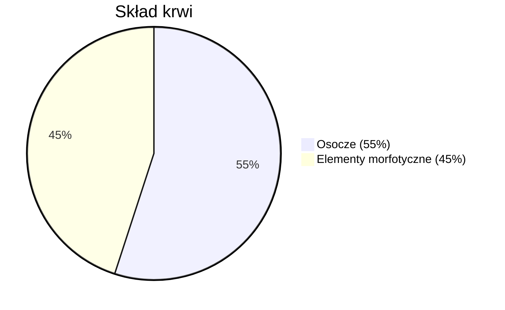

**Krew** – płyn krążący w [[Układ krwionośny|układzie krwionośnym]], odpowiedzialny za transport substancji, utrzymanie odpowiedniej temperatury oraz ochronę przed infekcjami.

---

## Skład krwi

**Krew** składa się z **osocza** (~55% objętości) oraz **elementów morfotycznych** (~45%).

### Elementy morfotyczne

- **Erytrocyty** (krwinki czerwone)
- **Leukocyty** (krwinki białe)
- **Trombocyty** (płytki krwi)

### Osocze

Płynna część krwi zbudowana głównie z wody (~91–92%), zawierająca:

- Białka
- Sole mineralne (np. sodu i potasu)
- Elektrolity
- Substancje odżywcze (cukry, tłuszcze, witaminy)
- Hormony i enzymy
- Produkty przemiany materii

---

## Grupy krwi

Cztery podstawowe grupy krwi w układzie ABO: **A, B, AB i 0**.

Dwie główne grupy w układzie Rh: **Rh dodatni (Rh+)** i **Rh ujemny (Rh-)**.

Łącznie osiem typowych kombinacji: ARh+, ARh-, BRh+, BRh-, ABRh+, ABRh-, 0Rh+, 0Rh-.

---

## Zapamiętaj

- **Krew** = osocze (~55%) + elementy morfotyczne (~45%)
- **3 elementy morfotyczne**: erytrocyty (czerwone), leukocyty (białe), trombocyty (płytki)
- **Osocze** to głównie woda (~91–92%) + białka, sole, hormony, enzymy
- **8 grup krwi**: układ ABO (A, B, AB, 0) x układ Rh (+ lub -)

---

## Quiz

> [!question] Pytanie 1
> Z czego składa się krew?
>
> A) W 100% z osocza
> B) Z osocza (~55%) oraz elementów morfotycznych (~45%): erytrocytów, leukocytów i trombocytów
> C) Z samych erytrocytów i leukocytów
> D) Z wody (~91%) i białek (~9%)
>
> 

Odpowiedź
B) Osocze stanowi ~55% objętości, elementy morfotyczne (erytrocyty, leukocyty, trombocyty) ~45%.

> [!question] Pytanie 2
> Ile typowych kombinacji grup krwi wyróżniamy?
>
> A) 4 (A, B, AB, 0)
> B) 6
> C) 8 (układ ABO x układ Rh)
> D) 12
>
> 

Odpowiedź
C) 8 kombinacji – 4 grupy ABO (A, B, AB, 0) razy 2 warianty Rh (+ lub -).

> [!question] Pytanie 3
> Co stanowi główny składnik osocza?
>
> A) Białka (~91%)
> B) Woda (~91–92%)
> C) Erytrocyty (~91%)
> D) Elektrolity (~91%)
>
> 

Odpowiedź
B) Woda stanowi ~91–92% osocza.

---

## Źródła

- Bochenek A., Reicher M., *Anatomia człowieka*, PZWL
- Netter F.H., *Atlas anatomii człowieka*, Edra Urban & Partner
