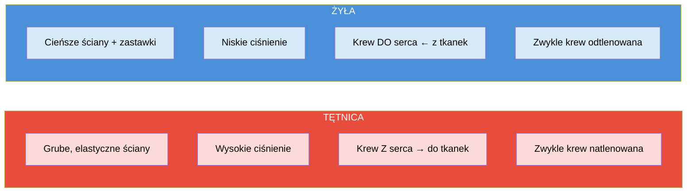

**Układ krwionośny** (sercowo-naczyniowy) – system składający się z serca, naczyń krwionośnych (tętnic, żył i kapilarów) oraz krążącej w nich krwi. Odpowiada za transport tlenu, składników odżywczych i hormonów, odbiór dwutlenku węgla i produktów przemiany materii, a także za utrzymywanie stałej temperatury ciała i równowagi (homeostazy).

---

## Funkcje układu krwionośnego

- **Transport** – dostarczanie tlenu, składników odżywczych, hormonów i wody do wszystkich komórek
- **Usuwanie** – odbieranie z komórek dwutlenku węgla oraz produktów przemiany materii i transportowanie ich do narządów wydalniczych (np. nerek, płuc)
- **Regulacja** – utrzymywanie stałej temperatury ciała, stabilizacja pH oraz zapewnienie równowagi środowiska wewnętrznego organizmu (homeostazy)
- **Obrona** – uczestnictwo w walce z drobnoustrojami

---

## Budowa

- **Serce** – mięśniowy narząd pełniący rolę pompy, który przepompowuje i tłoczy krew w naczyniach
- **Naczynia krwionośne** – tętnice, żyły i kapilary
- **[[Krew]]** – płyn krążący w układzie

---

## Naczynia krwionośne

- **Tętnice** – naczynia wyprowadzające krew z serca do tkanek i narządów. Zbudowane z grubych, elastycznych ścian, przenoszą krew pod wysokim ciśnieniem (zwykle natlenowaną)
- **Żyły** – naczynia doprowadzające krew z powrotem do serca. Mają cieńsze, mniej elastyczne ściany i zastawki zapobiegające cofaniu się krwi (zwykle odtlenowaną)
- **Kapilary (naczynia włosowate)** – bardzo cienkie naczynia, w których zachodzi wymiana tlenu i składników odżywczych między krwią a komórkami

---

## Choroby układu krążenia

Choroby serca, tętnic i żył, które mogą być związane m.in. z odkładaniem się blaszek miażdżycowych blokujących przepływ krwi:

- Nadciśnienie tętnicze
- Miażdżyca
- Choroba wieńcowa
- Zawał serca
- Udar mózgu
- Niewydolność serca
- Zaburzenia rytmu serca (np. migotanie przedsionków)
- Zakrzepica żylna
- Zatorowość płucna

---

## Zapamiętaj

- **4 funkcje układu krwionośnego**: transport, usuwanie, regulacja, obrona
- **Tętnice** = grube ściany, wysokie ciśnienie, krew Z serca; **żyły** = cieńsze ściany, zastawki, krew DO serca
- **Kapilary** to miejsce wymiany gazowej i odżywczej między krwią a komórkami
- Układ krwionośny = serce + naczynia + [[Krew|krew]]

---

## Quiz

> [!question] Pytanie 1
> Jakie są cztery główne funkcje układu krwionośnego?
>
> A) Transport, usuwanie, trawienie, obrona
> B) Transport, usuwanie, regulacja, obrona
> C) Transport, oddychanie, regulacja, obrona
> D) Regulacja, obrona, wydzielanie, transport
>
> 

Odpowiedź
B) Transport, usuwanie, regulacja, obrona.

> [!question] Pytanie 2
> Czym różni się tętnica od żyły?
>
> A) Tętnica ma cieńsze ściany i zastawki
> B) Żyła wyprowadza krew z serca pod wysokim ciśnieniem
> C) Tętnica ma grube elastyczne ściany i wyprowadza krew z serca, żyła ma cieńsze ściany z zastawkami i doprowadza krew do serca
> D) Nie ma różnicy strukturalnej, różnią się tylko kierunkiem przepływu
>
> 

Odpowiedź
C) Tętnica – grube ściany, wysokie ciśnienie, krew z serca. Żyła – cieńsze ściany, zastawki, krew do serca.

> [!question] Pytanie 3
> Gdzie zachodzi wymiana tlenu i składników odżywczych między krwią a komórkami?
>
> A) W tętnicach
> B) W żyłach
> C) W kapilarach (naczyniach włosowatych)
> D) W sercu
>
> 

Odpowiedź
C) W kapilarach – bardzo cienkie naczynia umożliwiające wymianę substancji.

---

## Źródła

- Bochenek A., Reicher M., *Anatomia człowieka*, PZWL
- Netter F.H., *Atlas anatomii człowieka*, Edra Urban & Partner
