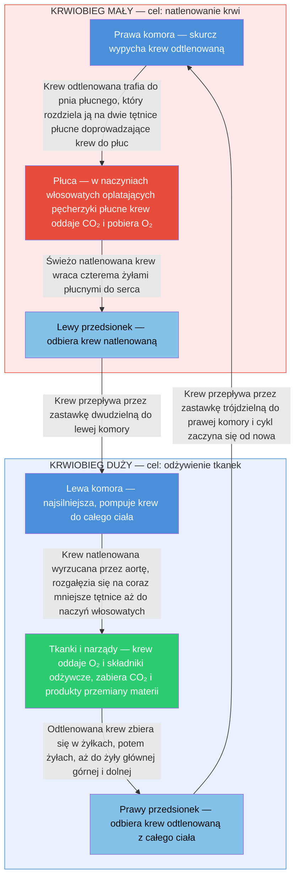

## Krwiobieg mały (płucny)

**Krwiobieg mały (płucny)** – obieg krwi odpowiedzialny za natlenowanie krwi. Krew odtlenowana jest pompowana z prawej komory serca do pnia płucnego.

### Droga do płuc

Pień płucny rozgałęzia się na **tętnicę płucną prawą i lewą**, które prowadzą krew do płuc.

### Wymiana gazowa

W płucach, w sieci **naczyń włosowatych** oplatających pęcherzyki płucne, odbywa się wymiana gazowa – krew oddaje dwutlenek węgla i pobiera tlen.

### Powrót do serca

Natlenowana krew z płuc przepływa przez **żyły płucne** do lewego przedsionka serca, a następnie trafia do lewej komory.

---

## Krwiobieg duży (ustrojowy)

**Krwiobieg duży (ustrojowy)** – obieg krwi odpowiedzialny za dostarczanie tlenu i składników odżywczych do wszystkich tkanek i narządów ciała.

### Początek

Natlenowana krew jest pompowana z **lewej komory serca** przez główną tętnicę ciała – **aortę**.

### Rozprowadzenie do organizmu

Aorta rozgałęzia się na coraz mniejsze tętnice, a następnie na **naczynia włosowate** oplatające wszystkie tkanki i narządy ciała.

### Wymiana substancji

W naczyniach włosowatych odbywa się wymiana: krew dostarcza tlen i składniki odżywcze, a odbiera dwutlenek węgla oraz inne produkty przemiany materii.

### Powrót do serca

Odtlenowana krew płynie żyłami, które zbierają się w **żyłach głównych: górnej i dolnej**, a następnie wpływają do prawego przedsionka serca, kończąc obieg.

---

## Podsumowanie funkcji

- **Mały obieg (płucny)** – odpowiada za utlenowanie krwi w płucach i usunięcie z niej dwutlenku węgla
- **Duży obieg (ustrojowy)** – zaopatruje wszystkie narządy w tlen i substancje odżywcze oraz odbiera od nich dwutlenek węgla

---

## Zapamiętaj

- **Krwiobieg mały** zaczyna się w **prawej komorze** i kończy w **lewym przedsionku** – jego celem jest natlenowanie krwi
- **Krwiobieg duży** zaczyna się w **lewej komorze** i kończy w **prawym przedsionku** – dostarcza tlen do tkanek
- W tętnicach płucnych płynie krew **odtlenowana** – wyjątek od reguły
- W żyłach płucnych płynie krew **natlenowana** – kolejny wyjątek
- Schemat: prawa komora → płuca → lewy przedsionek → lewa komora → aorta → tkanki → żyły główne → prawy przedsionek

---

## Quiz

> [!question] Pytanie 1
> Skąd rozpoczyna się krwiobieg mały?
>
> A) Z lewej komory serca
> B) Z prawej komory serca
> C) Z lewego przedsionka serca
> D) Z prawego przedsionka serca
>
> 

Odpowiedź
B) Z prawej komory serca – krew odtlenowana jest pompowana do pnia płucnego.

> [!question] Pytanie 2
> Co jest wyjątkowe w tętnicach płucnych?
>
> A) Są najgrubszymi tętnicami w organizmie
> B) Prowadzą krew natlenowaną
> C) Prowadzą krew odtlenowaną (wbrew nazwie "tętnica")
> D) Łączą się bezpośrednio z aortą
>
> 

Odpowiedź
C) Tętnice płucne prowadzą krew odtlenowaną – to wyjątek od reguły, że tętnice niosą krew natlenowaną.

> [!question] Pytanie 3
> Skąd rozpoczyna się krwiobieg duży?
>
> A) Z prawej komory serca
> B) Z lewego przedsionka serca
> C) Z lewej komory serca przez aortę
> D) Z pnia płucnego
>
> 

Odpowiedź
C) Z lewej komory serca – natlenowana krew jest pompowana przez aortę do całego ciała.

> [!question] Pytanie 4
> Gdzie kończy się krwiobieg duży?
>
> A) W lewym przedsionku serca
> B) W prawym przedsionku serca przez żyły główne
> C) W pniu płucnym
> D) W lewej komorze serca
>
> 

Odpowiedź
B) W prawym przedsionku serca – odtlenowana krew wpływa przez żyłę główną górną i dolną.

---

## Źródła

- Bochenek A., Reicher M., *Anatomia człowieka*, PZWL
- Netter F.H., *Atlas anatomii człowieka*, Edra Urban & Partner
