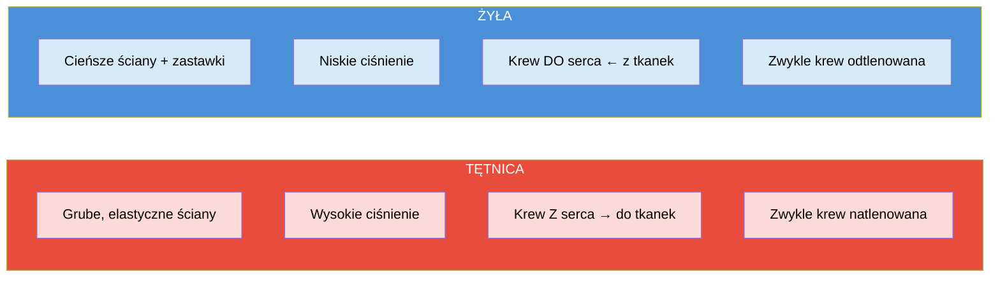
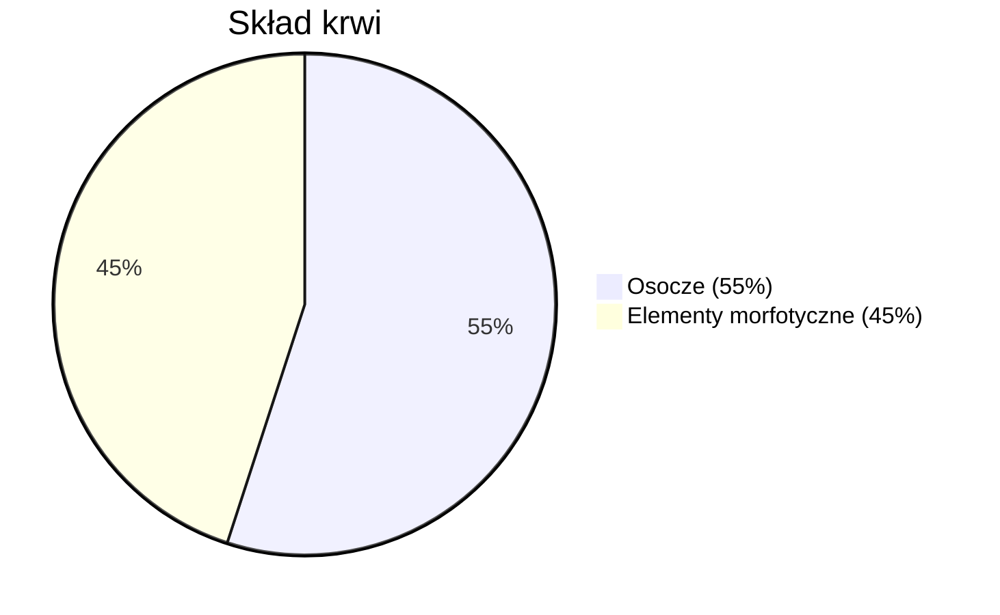
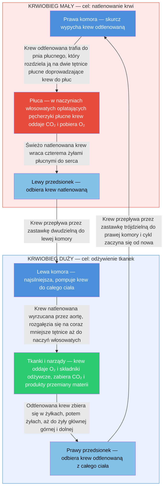

## Funkcje układu krwionośnego

- **Transport** – dostarczanie tlenu, składników odżywczych, hormonów i wody do wszystkich komórek
- **Usuwanie** – odbieranie z komórek dwutlenku węgla oraz produktów przemiany materii i transportowanie ich do narządów wydalniczych (np. nerek, płuc)
- **Regulacja** – utrzymywanie stałej temperatury ciała, stabilizacja pH oraz zapewnienie równowagi środowiska wewnętrznego organizmu (homeostazy)
- **Obrona** – uczestnictwo w walce z drobnoustrojami

---

## Budowa układu krwionośnego

**Układ krwionośny** (sercowo-naczyniowy) – system składający się z:

- **Serca** – mięśniowy narząd pełniący rolę pompy, który przepompowuje i tłoczy krew w naczyniach
- **Naczyń krwionośnych** – tętnic, żył i kapilarów
- **Krwi** – płyn krążący w układzie

### Naczynia krwionośne

- **Tętnice** – naczynia wyprowadzające krew z serca do tkanek i narządów. Zbudowane z grubych, elastycznych ścian, przenoszą krew pod wysokim ciśnieniem (zwykle natlenowaną)
- **Żyły** – naczynia doprowadzające krew z powrotem do serca. Mają cieńsze, mniej elastyczne ściany i zastawki zapobiegające cofaniu się krwi (zwykle odtlenowaną)
- **Kapilary (naczynia włosowate)** – bardzo cienkie naczynia, w których zachodzi wymiana tlenu i składników odżywczych między krwią a komórkami

---

## Krew

**Krew** składa się z **osocza** (~55% objętości) oraz **elementów morfotycznych** (~45%).

### Elementy morfotyczne

- **Erytrocyty** (krwinki czerwone)
- **Leukocyty** (krwinki białe)
- **Trombocyty** (płytki krwi)

### Osocze

Płynna część krwi zbudowana głównie z wody (~91–92%), zawierająca:

- Białka
- Sole mineralne (np. sodu i potasu)
- Elektrolity
- Substancje odżywcze (cukry, tłuszcze, witaminy)
- Hormony i enzymy
- Produkty przemiany materii

### Funkcja krwi

Transportuje różne związki po organizmie, utrzymuje odpowiednią lepkość oraz parametry środowiska wewnętrznego.

---

## Grupy krwi

Cztery podstawowe grupy krwi w układzie ABO: **A, B, AB i 0**.

Dwie główne grupy w układzie Rh: **Rh dodatni (Rh+)** i **Rh ujemny (Rh-)**.

Łącznie osiem typowych kombinacji: ARh+, ARh-, BRh+, BRh-, ABRh+, ABRh-, 0Rh+, 0Rh-.

---

## Choroby układu krążenia

Choroby serca, tętnic i żył, które mogą być związane m.in. z odkładaniem się blaszek miażdżycowych blokujących przepływ krwi:

- Nadciśnienie tętnicze
- Miażdżyca
- Choroba wieńcowa
- Zawał serca
- Udar mózgu
- Niewydolność serca
- Zaburzenia rytmu serca (np. migotanie przedsionków)
- Zakrzepica żylna
- Zatorowość płucna

---

## Krwiobieg mały (płucny)

**Krwiobieg mały (płucny)** – obieg krwi odpowiedzialny za natlenowanie krwi. Krew odtlenowana jest pompowana z prawej komory serca do pnia płucnego.

### Droga do płuc

Pień płucny rozgałęzia się na **tętnicę płucną prawą i lewą**, które prowadzą krew do płuc.

### Wymiana gazowa

W płucach, w sieci **naczyń włosowatych** oplatających pęcherzyki płucne, odbywa się wymiana gazowa – krew oddaje dwutlenek węgla i pobiera tlen.

### Powrót do serca

Natlenowana krew z płuc przepływa przez **żyły płucne** do lewego przedsionka serca, a następnie trafia do lewej komory.

---

## Krwiobieg duży (ustrojowy)

**Krwiobieg duży (ustrojowy)** – obieg krwi odpowiedzialny za dostarczanie tlenu i składników odżywczych do wszystkich tkanek i narządów ciała.

### Początek

Natlenowana krew jest pompowana z **lewej komory serca** przez główną tętnicę ciała – **aortę**.

### Rozprowadzenie do organizmu

Aorta rozgałęzia się na coraz mniejsze tętnice, a następnie na **naczynia włosowate** oplatające wszystkie tkanki i narządy ciała.

### Wymiana substancji

W naczyniach włosowatych odbywa się wymiana: krew dostarcza tlen i składniki odżywcze, a odbiera dwutlenek węgla oraz inne produkty przemiany materii.

### Powrót do serca

Odtlenowana krew płynie żyłami, które zbierają się w **żyłach głównych: górnej i dolnej**, a następnie wpływają do prawego przedsionka serca, kończąc obieg.

---

## Podsumowanie funkcji

- **Mały obieg (płucny)** – odpowiada za utlenowanie krwi w płucach i usunięcie z niej dwutlenku węgla
- **Duży obieg (ustrojowy)** – zaopatruje wszystkie narządy w tlen i substancje odżywcze oraz odbiera od nich dwutlenek węgla

---

## Zapamiętaj

- **4 funkcje układu krwionośnego**: transport, usuwanie, regulacja, obrona
- **Tętnice** = grube ściany, wysokie ciśnienie, krew Z serca; **żyły** = cieńsze ściany, zastawki, krew DO serca
- **Krew**: osocze (~55%) + elementy morfotyczne (~45%): erytrocyty, leukocyty, trombocyty
- **Krwiobieg mały**: prawa komora → płuca → lewy przedsionek (cel: natlenowanie)
- **Krwiobieg duży**: lewa komora → aorta → tkanki → żyły główne → prawy przedsionek (cel: odżywienie tkanek)
- **Wyjątek**: tętnice płucne niosą krew odtlenowaną, żyły płucne – natlenowaną

---

## Quiz

> [!question] Pytanie 1
> Jakie są cztery główne funkcje układu krwionośnego?
>
> A) Transport, usuwanie, trawienie, obrona
> B) Transport, usuwanie, regulacja, obrona
> C) Transport, oddychanie, regulacja, obrona
> D) Regulacja, obrona, wydzielanie, transport
>
> 

Odpowiedź
B) Transport, usuwanie, regulacja, obrona.

> [!question] Pytanie 2
> Czym różni się tętnica od żyły?
>
> A) Tętnica ma cieńsze ściany i zastawki
> B) Żyła wyprowadza krew z serca pod wysokim ciśnieniem
> C) Tętnica ma grube elastyczne ściany i wyprowadza krew z serca, żyła ma cieńsze ściany z zastawkami i doprowadza krew do serca
> D) Nie ma różnicy strukturalnej, różnią się tylko kierunkiem przepływu
>
> 

Odpowiedź
C) Tętnica – grube ściany, wysokie ciśnienie, krew z serca. Żyła – cieńsze ściany, zastawki, krew do serca.

> [!question] Pytanie 3
> Z czego składa się krew?
>
> A) W 100% z osocza
> B) Z osocza (~55%) oraz elementów morfotycznych (~45%): erytrocytów, leukocytów i trombocytów
> C) Z samych erytrocytów i leukocytów
> D) Z wody (~91%) i białek (~9%)
>
> 

Odpowiedź
B) Osocze stanowi ~55% objętości, elementy morfotyczne (erytrocyty, leukocyty, trombocyty) ~45%.

> [!question] Pytanie 4
> Skąd rozpoczyna się krwiobieg mały, a skąd duży?
>
> A) Oba zaczynają się w lewej komorze
> B) Mały z prawej komory, duży z lewej komory
> C) Mały z lewego przedsionka, duży z prawego przedsionka
> D) Mały z lewej komory, duży z prawej komory
>
> 

Odpowiedź
B) Krwiobieg mały zaczyna się w prawej komorze (do płuc), duży w lewej komorze (przez aortę do całego ciała).

---

## Źródła

- Bochenek A., Reicher M., *Anatomia człowieka*, PZWL
- Netter F.H., *Atlas anatomii człowieka*, Edra Urban & Partner
